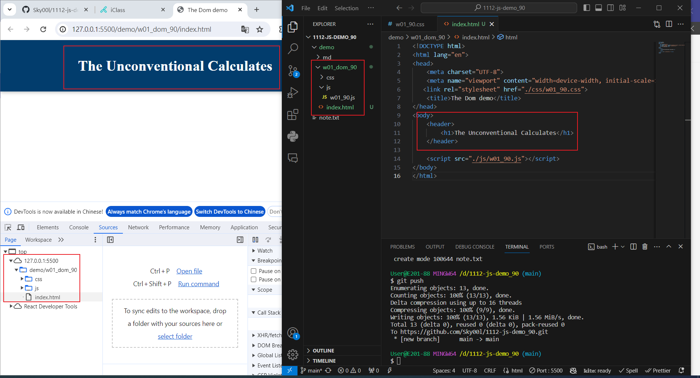
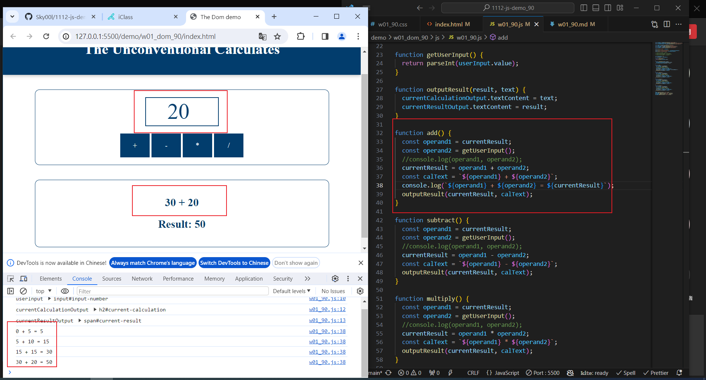
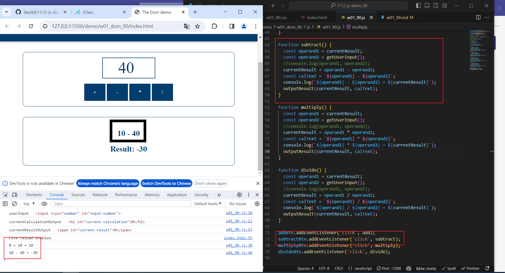
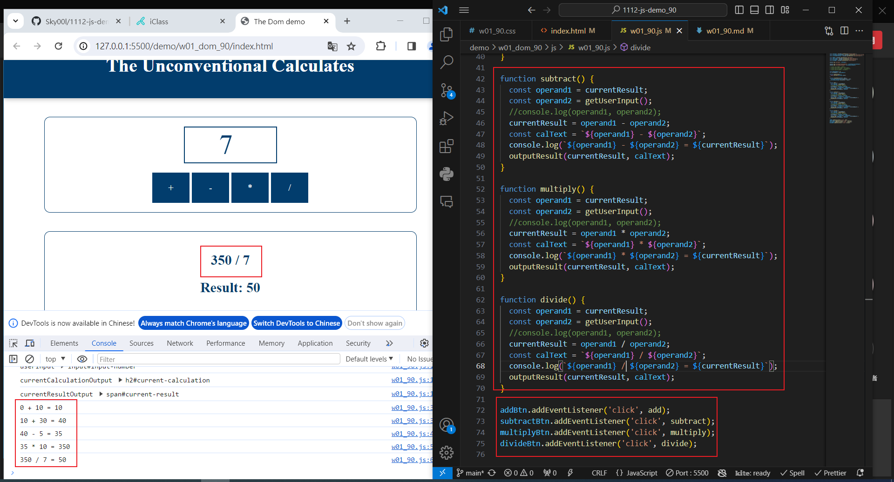
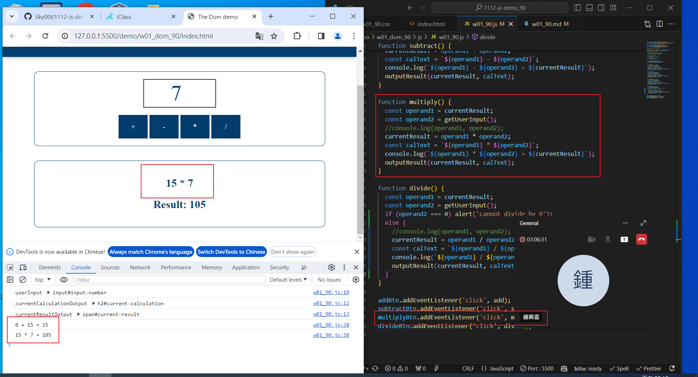
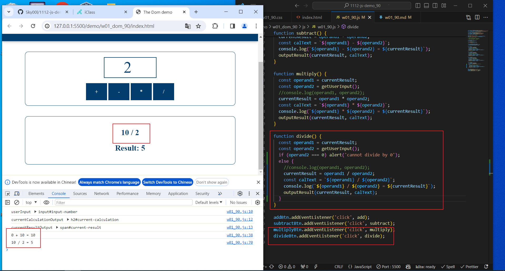

[My Github URL](https://github.com/Sky00l/1112-js-demo_90.git)

### W1-P1: show the w01-dom title



```
git log --pretty=format:"%h%x09%an%x09%ad%x09%s" --after="2024-02-20"
5629176 Sky00l  Thu Feb 22 19:36:41 2024 +0800  W1-P1: show the w01-dom title

```

### W01-P2: implement add function




```
git log --pretty=format:"%h%x09%an%x09%ad%x09%s" --after="2024-02-20"
86c3947 Sky00l  Thu Feb 22 21:07:23 2024 +0800   W01-P2: implement add function

```

### W01-P3: implement subtract function



### W01-P4: implement multiply function



### W01-P5: implement divide function

|


### W1-P3: Git logs of W1

```
git log --pretty=format:"%h%x09%an%x09%ad%x09%s" --after="2024-02-20"
9ea500b Sky00l  Thu Feb 22 21:08:43 2024 +0800  upload w01_90.pdf
86c3947 Sky00l  Thu Feb 22 21:07:23 2024 +0800   W01-P2: implement add function
5629176 Sky00l  Thu Feb 22 19:36:41 2024 +0800  W1-P1: show the w01-dom title
52d8b27 Sky00l  Thu Feb 22 19:23:43 2024 +0800  first commit

```
