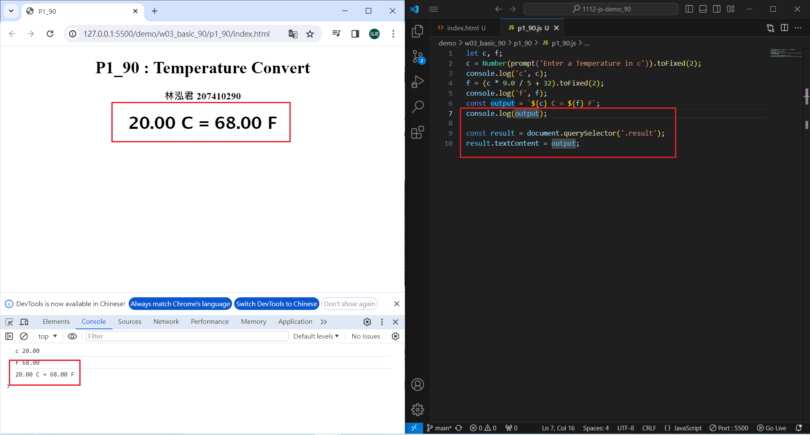
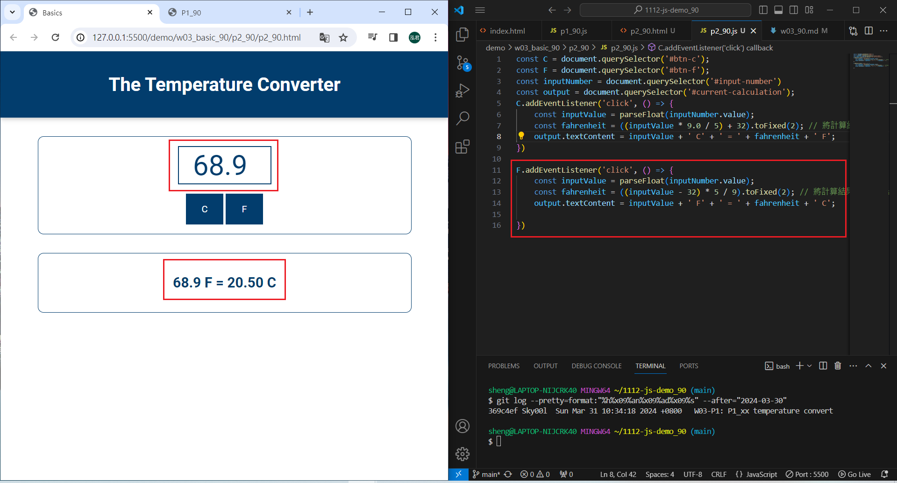

[My Github URL](https://github.com/Sky00l/1112-js-demo_90.git)

### W03-P1: P1_xx temperature convert
 


```
$ git log --pretty=format:"%h%x09%an%x09%ad%x09%s" --after="2024-03-30"
369c4ef Sky00l  Sun Mar 31 10:34:18 2024 +0800   W03-P1: P1_xx temperature convert
```

### ### W03-P2: P2_xx temperature convert using Web
 
##### => From C to F
 

 
##### => From F to C
 


```
$ git log --pretty=format:"%h%x09%an%x09%ad%x09%s" --after="2024-02-28"
702d4c3 Sky00l  Thu Feb 29 19:57:26 2024 +0800  W02-P2: implement reset button
0115e51 Sky00l  Thu Feb 29 19:02:34 2024 +0800  W02-P1: Show Tictactoe css

```

### W02-P3: implement reset button


```
$ git log --pretty=format:"%h%x09%an%x09%ad%x09%s" --after="2024-02-28"
702d4c3 Sky00l  Thu Feb 29 19:57:26 2024 +0800  W02-P2: implement reset button
0115e51 Sky00l  Thu Feb 29 19:02:34 2024 +0800  W02-P1: Show Tictactoe css

```

### W2-P3: Git logs of W1

```
git log --pretty=format:"%h%x09%an%x09%ad%x09%s" --after="2024-02-28"
9ea500b Sky00l  Thu Feb 22 21:08:43 2024 +0800  upload w01_90.pdf
86c3947 Sky00l  Thu Feb 22 21:07:23 2024 +0800   W01-P2: implement add function
5629176 Sky00l  Thu Feb 22 19:36:41 2024 +0800  W1-P1: show the w01-dom title
52d8b27 Sky00l  Thu Feb 22 19:23:43 2024 +0800  first commit

```
