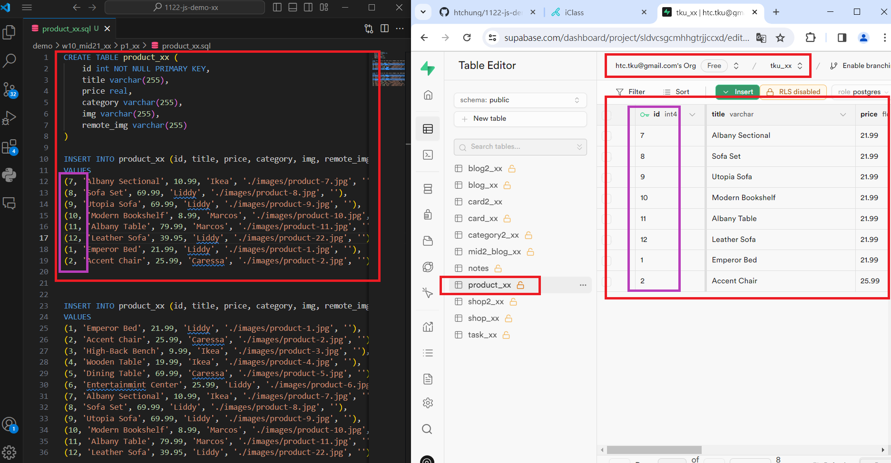
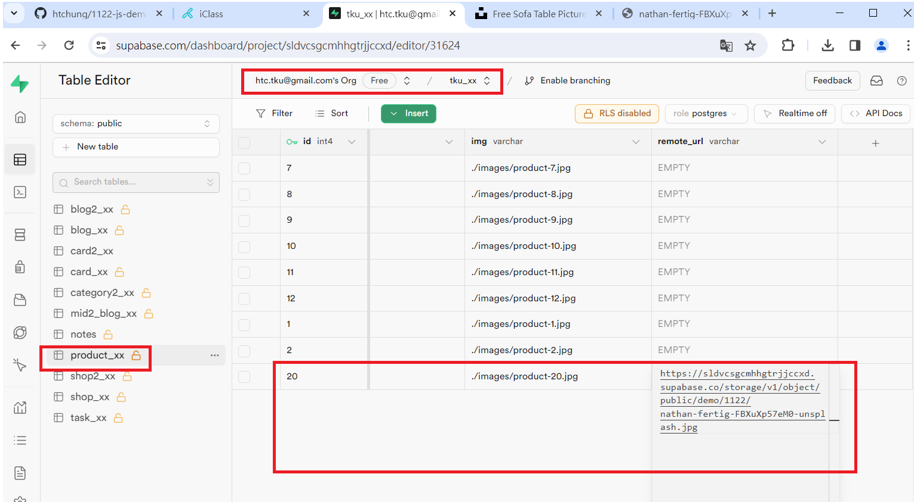
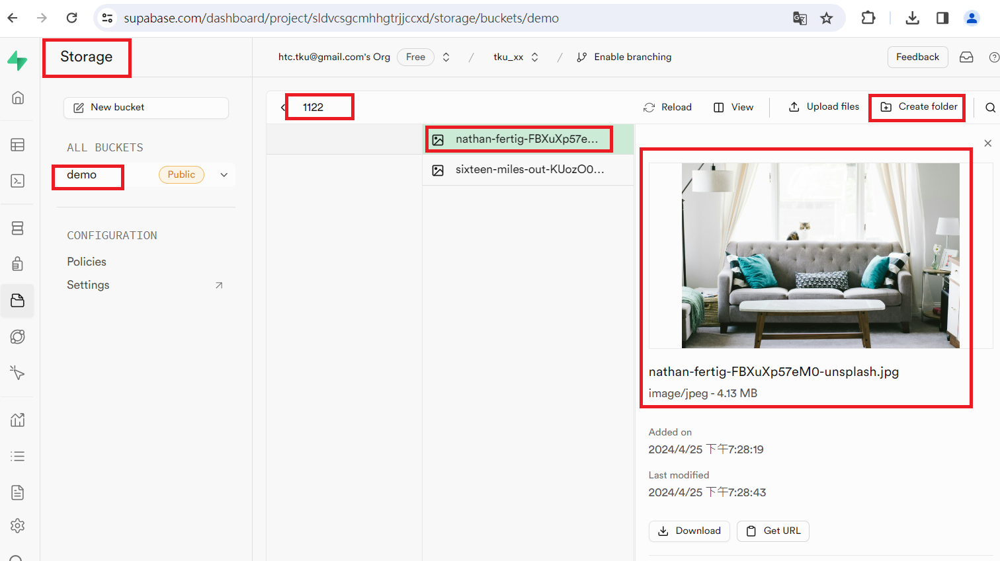
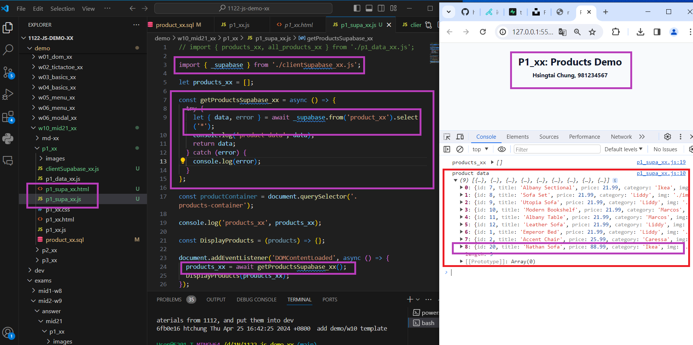
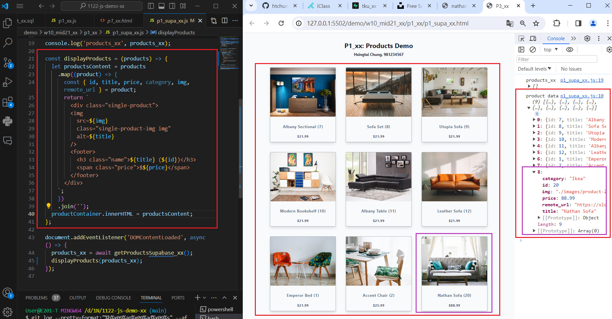

[My Github URL](https://github.com/Sky00l/1112-js-demo_90.git)
 
### ### W10-P1: In Supabase, create product_xx table with 8 product data
 


```
$ git log --pretty=format:"%h%x09%an%x09%ad%x09%s" --after="2024-06-12"
6a2652a Sky00l  Thu Jun 13 09:06:52 2024 +0800  W10-P1: In Supabase, create product_xx table with 8 product data

```

### W10-P2: Get a photo from unsplash, and put it into storage in Supabase
 

 

 


```
$ git log --pretty=format:"%h%x09%an%x09%ad%x09%s" --after="2024-06-12"
6a0b944 Sky00l  Thu Jun 13 09:09:57 2024 +0800  W10-P2: Get a photo from unsplash, and put it into storage in Supabase

```
 
### W10-P3: Get 9 products data from Supabase, and show in console
 



```
$ git log --pretty=format:"%h%x09%an%x09%ad%x09%s" --after="2024-06-12"
81a4ef Sky00l  Thu Jun 13 09:11:39 2024 +0800  W10-P3: Get 9 products data from Supabase, and show in console
```

### W10-P4: Show products retrieved from Supabase
 


```
$ git log --pretty=format:"%h%x09%an%x09%ad%x09%s" --after="2024-06-12"
945e474 Sky00l  Thu Jun 13 09:12:35 2024 +0800  W10-P4: Show products retrieved from Supabase

```


###  W10-P5: git logs for W10
 
```
git log --pretty=format:"%h%x09%an%x09%ad%x09%s" --after="2024-04-24"
945e474 Sky00l  Thu Jun 13 09:12:35 2024 +0800  W10-P4: Show products retrieved from Supabase
581a4ef Sky00l  Thu Jun 13 09:11:39 2024 +0800  W10-P3: Get 9 products data from Supabase, and show in console    
6a0b944 Sky00l  Thu Jun 13 09:09:57 2024 +0800  W10-P2: Get a photo from unsplash, and put it into storage in Supabase
6a2652a Sky00l  Thu Jun 13 09:06:52 2024 +0800  W10-P1: In Supabase, create product_xx table with 8 product data 
```