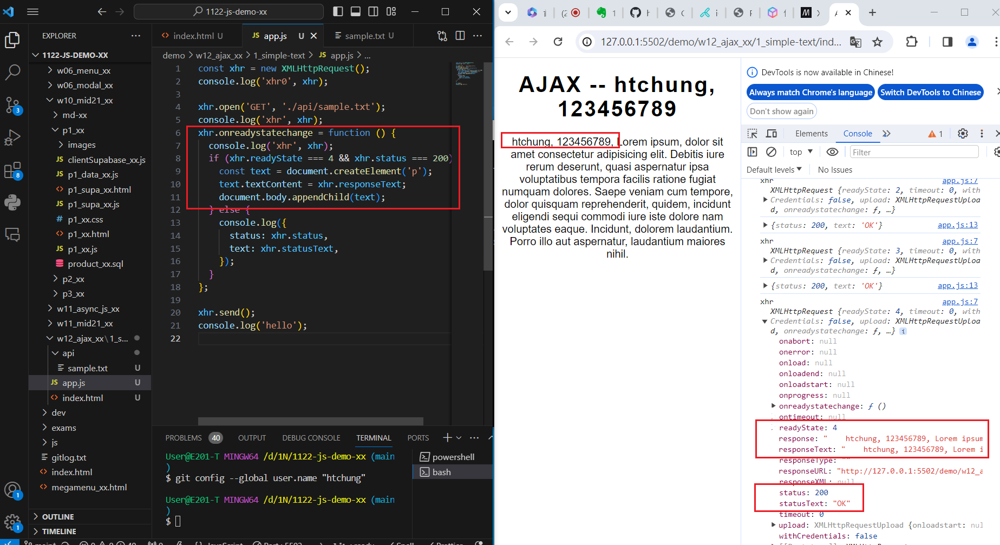
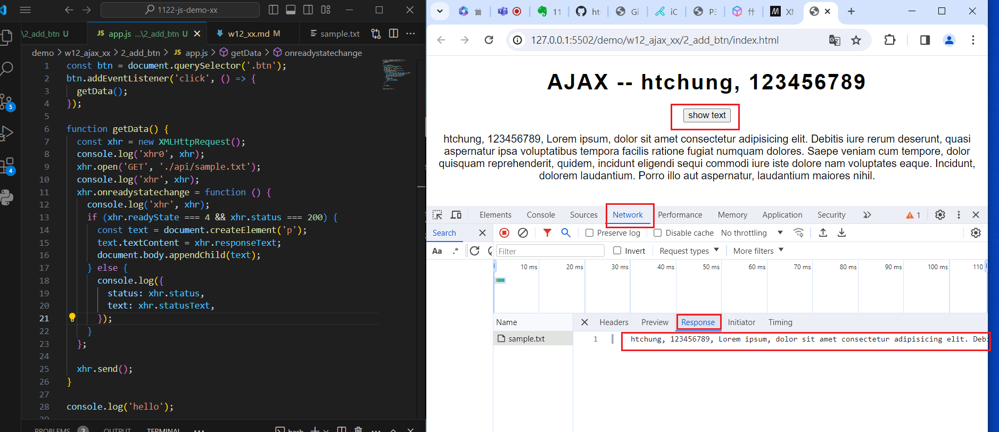
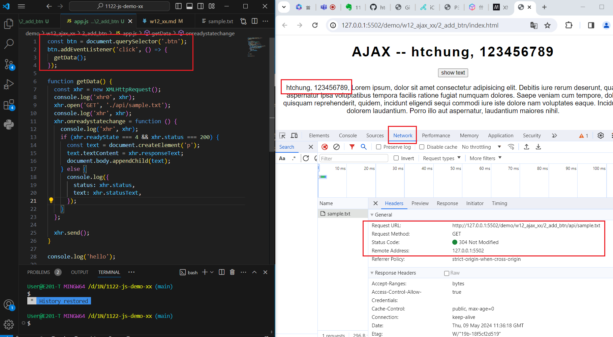
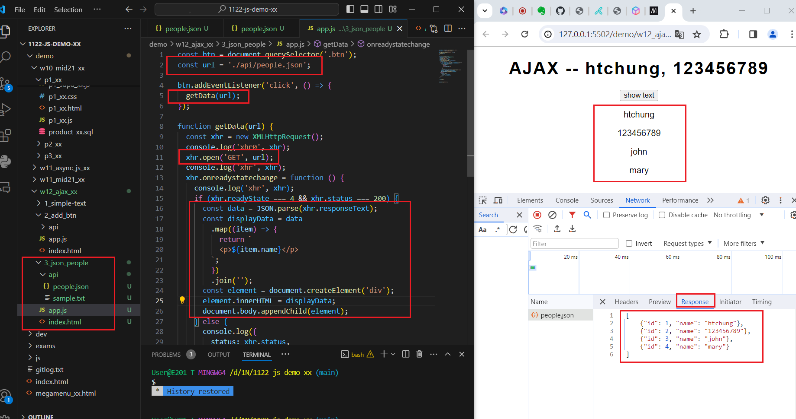
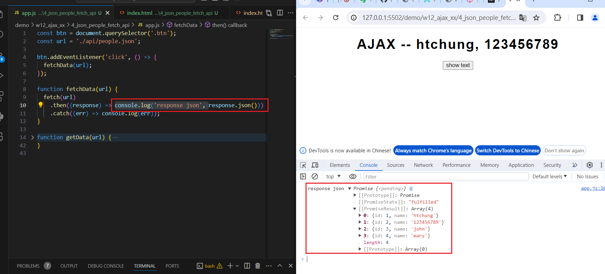
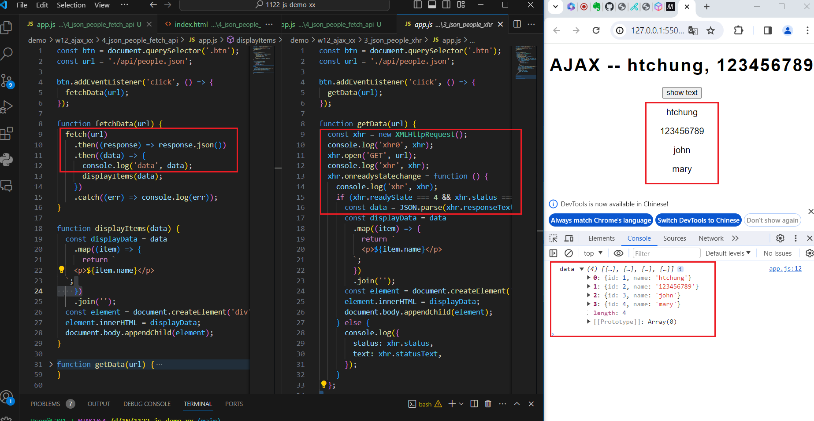
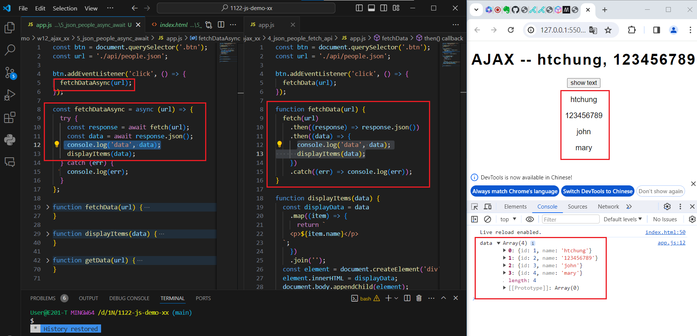

[My Github URL](https://github.com/Sky00l/1112-js-demo_90.git)
 
### W12-P1: Do 1_simple-text
 


```
$ git log --pretty=format:"%h%x09%an%x09%ad%x09%s" --after="2024-06-12"
90bd9eb Sky00l  Thu Jun 13 09:59:15 2024 +0800  W12-P1: Do 1_simple-text

```

### W12-P2: Do 2_add_btn
 
#### => Network, Header
 

 
#### => Network, Response
 


```
$ git log --pretty=format:"%h%x09%an%x09%ad%x09%s" --after="2024-06-12"
8aa4daa Sky00l  Thu Jun 13 10:01:31 2024 +0800  W12-P2: Do 2_add_btn
```
 
### W12-P3: Do 3_json_people_xhr
 

 

```
$ git log --pretty=format:"%h%x09%an%x09%ad%x09%s" --after="2024-06-12"
fcb128b Sky00l  Thu Jun 13 10:10:22 2024 +0800  W12-P3: Do 3_json_people_xhr 
```

### W12-P4: Do 3_json_people_fetch_api
 
#### => fetch(url).then(response => response.json())
 

 
#### => fetch api vs.xhr
 


```
$ git log --pretty=format:"%h%x09%an%x09%ad%x09%s" --after="2024-06-12"
65a31f2 Sky00l  Thu Jun 13 10:15:24 2024 +0800  W12-P4: Do 3_json_people_fetch_api
```

###  W12-P5: Do 3_json_people_async_await
 


```

```

### W11-P5: git logs for W11
 
```
git log --pretty=format:"%h%x09%an%x09%ad%x09%s" --after="2024-06-12"
65a31f2 Sky00l  Thu Jun 13 10:15:24 2024 +0800  W12-P4: Do 3_json_people_fetch_api
fcb128b Sky00l  Thu Jun 13 10:10:22 2024 +0800  W12-P3: Do 3_json_people_xhr
8aa4daa Sky00l  Thu Jun 13 10:01:31 2024 +0800  W12-P2: Do 2_add_btn
90bd9eb Sky00l  Thu Jun 13 09:59:15 2024 +0800  W12-P1: Do 1_simple-text
```