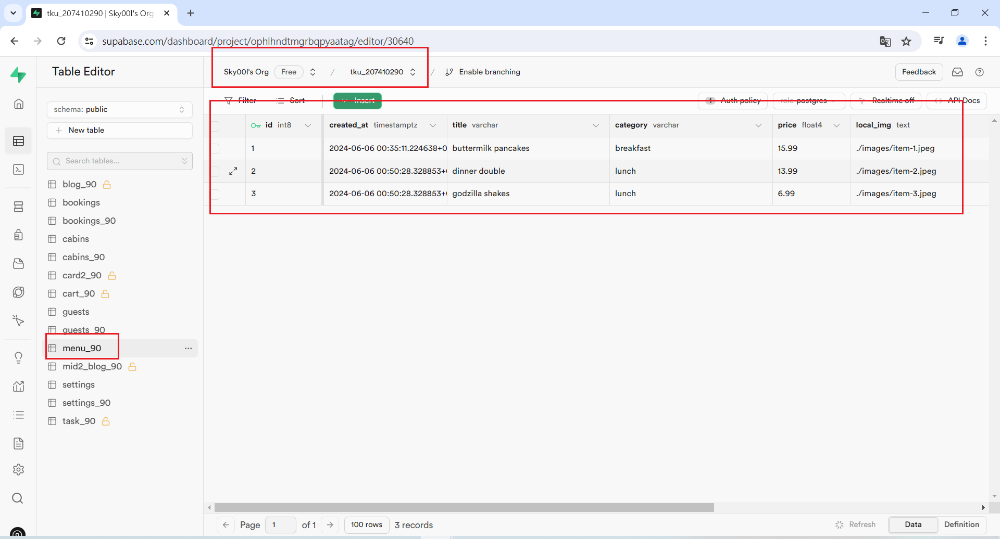

[My Github URL](https://github.com/Sky00l/1112-js-demo_90.git)
 
### W13-P1: Get 3 menu data from /api/data_xx.json
 


```
$ git log --pretty=format:"%h%x09%an%x09%ad%x09%s" --after="2024-06-05"
0115e51 Sky00l  Thu Feb 29 19:02:34 2024 +0800  W02-P1: Show Tictactoe css

```

### W13-P2: Create 3 menu data from Supabase
 
#### => create menu_xx table, and add 1 menu data
 

 
#### => add RLS read policy for public access
 

 
#### => add two more menu data from SQL command
 

 
#### => show 3 menu data from menu_xx table
 


```
$ git log --pretty=format:"%h%x09%an%x09%ad%x09%s" --after="2024-06-05"
0115e51 Sky00l  Thu Feb 29 19:02:34 2024 +0800  W02-P1: Show Tictactoe css

```
 


### W06-P6: git logs for W6